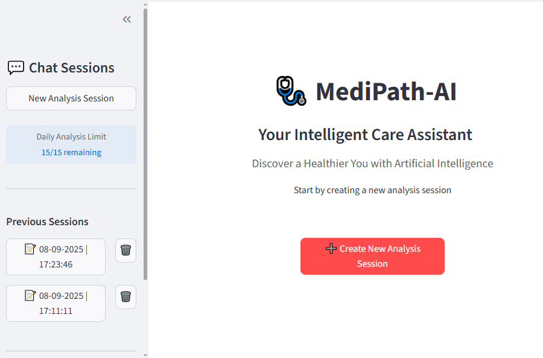
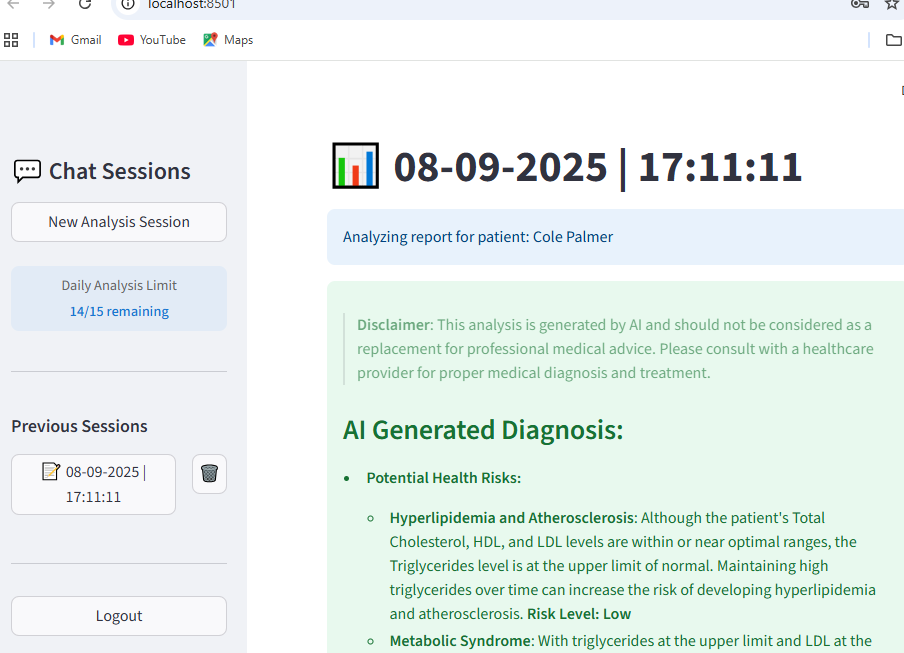

# 🩺 MediPath-AI
# Guiding Smarter Healthcare in Low-Resource Settings.

## 📖 Overview.

MediPath AI is an AI-powered Multilingual healthcare assistant designed to support patients, nurses and doctors in low-resource settings.The platform leverages Generative AI (via Groq API), Natural Language Processing (NLP), and knowledge-driven pipelines to provide:
- Accessible medical insights
- Decision support for health workers
- Personalized health guidance for patients

By integrating Streamlit for rapid deployment and Supabase for authentication & data storage, MediPath AI aims to bridge the healthcare gap for underserved communities.

## 🎯 Objectives.
Provide intelligent analysis of medical test reports with actionable recommendations. 
Optimize for low-bandwidth, low-resource environments. 
Ensure security, privacy, and trustworthiness in handling sensitive health data.

## ❗ Problem Statement.
Millions of people in low-resource settings face:
- Limited access to healthcare professionals
- Inadequate digital infrastructure
- Delayed diagnosis & treatment

MediPath AI addresses these challenges with a lightweight, AI-driven solution.

## 🌟 Features

~ Multilingual healthcare assistant (patients, nurses, doctors).  
~ AI-powered analysis of medical reports (PDF upload supported).  
~ Generative AI health insights via Groq LLMs.  
~ Secure authentication using Supabase.  
~ Persistent chat history and medical report storage.  
~ Mobile-friendly & responsive Streamlit interface

## 🛠️ Tech Stack
Language: Python 3.11  
Frontend/UI: Streamlit.  
Database & Auth: Supabase(PostgreSQL + Auth).  
Generative AI: Groq API.  
Document Processing: pdfplumber, custom validators.  
Deployment: Streamlit

## ⚙️ Installation and Setup
### 1. Clone the Repository
git clone https://github.com/NedRaph/MediPath_AI---Guiding-Smarter-Healthcare-in-Low-Resource-Settings  

### 2. Create and activate a Virtual Environment
conda create -p venv python==3.11 -y  
conda activate venv

### 3. Install Dependencies
pip install -r requirements.txt

### 4. Set Up Supabase and Configure secrets.
Create a Supabase project at supabase.com  
Open the SQL Editor and run the schema script: (see script.sql inside the public/db folder)  
Copy your Supabase credentials and add them (along with your Groq API key) into the secrets.toml file inside the .streamlit folder of the project.

SUPABASE_URL = "your-supabase-url"  
SUPABASE_KEY = "your-supabase-key"  
GROQ_API_KEY = "your-groq-api-key"

### 5. Run the Application
streamlit run src/main.py  
The app will launch at: http://localhost:8501

## ▶️ Usage
Sign up / log in (accounts stored in Supabase).  
Create a new analysis session.  
Upload a medical report (PDF) - AI generates analysis.  
View personalized recommendations & save history.

## Example Demo

- Uploading a CBC report - AI highlights potential risks.
- Lipid profile upload - AI suggests lifestyle changes.
- Supports chat-like health Q&A with Generative AI.

### Security & Privacy

Supabase manages authentication & session handling.  
Only validated medical reports (via validators.py) are accepted.

## 📌 Future Improvements.
To make MediPath-AI even more impactful, here are planned future improvements and features:

1. Multilingual Support.  
Expand communication beyond English to include Swahili, French, and local mother tongues, improving accessibility for diverse communities.

2. Domain-Specialist Medical Knowledge. 
Enhance AI prompts with curated knowledge bases and specialist-driven datasets for more accurate and context-aware medical insights.

3. Role-Specific Dashboards.  
Build customized interfaces for patients, nurses, and doctors, enabling each role to view relevant information and actions tailored to their needs.

4. Offline-First Mode.  
Introduce local caching and fallback models to allow healthcare workers to continue using the app in areas with poor or intermittent internet connectivity.

## Contributing

Contributions are Welcome! Please fork the repository and submit pull requests.

# 🚨Disclaimer

MediPath AI is not a replacement for medical professionals.  
All insights are AI-generated and should be verified by qualified healthcare providers.
